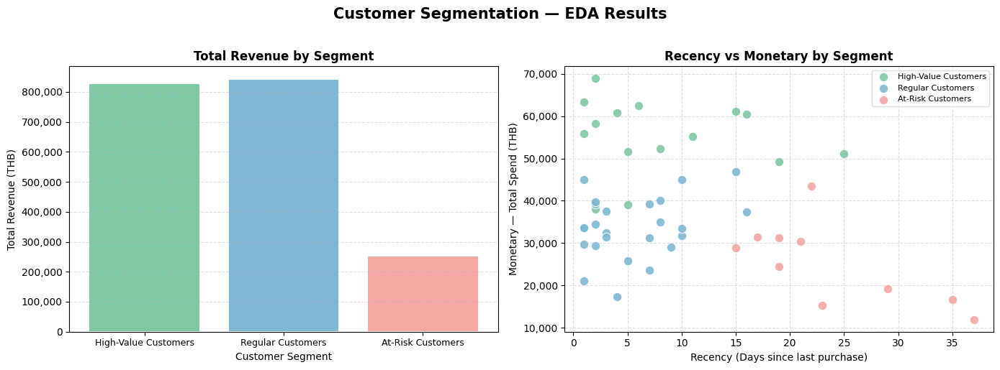
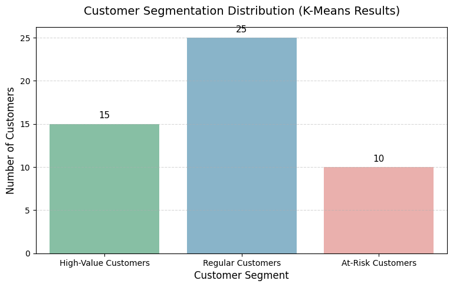

# Smart SME Retail: Customer Segmentation (RFM + K-Means)

โปรเจกต์นี้จัดทำขึ้นเพื่อนำเสนอระบบแบ่งกลุ่มลูกค้าอัจฉริยะ (Customer Segmentation) สำหรับธุรกิจ SME Retail โดยใช้เทคนิค **RFM Analysis** ร่วมกับโมเดล Machine Learning **K-Means Clustering** เพื่อช่วยให้ธุรกิจสามารถทำการตลาดแบบระบุตัวตน (Personalized Marketing) และเพิ่มประสิทธิภาพในการจัดสรรงบโปรโมชั่นได้อย่างแม่นยำ

---

## 🎯 1. โจทย์ทางธุรกิจและเป้าหมาย (Business Problem & Goals)
* **ผู้ใช้งานหลัก (Target Users):** ทีมการตลาด และเจ้าของร้าน SME Retail
* **ปัญหาที่พบ (Pain Point):** การทำโปรโมชั่นแบบหว่านแห (Mass Blast) ทำให้เสียกำไรโดยใช่เหตุให้กับกลุ่มที่พร้อมจะซื้ออยู่แล้ว และไม่สามารถรักษาลูกค้ากลุ่มเสี่ยง (At-Risk) ไว้ได้ทันเวลา
* **เป้าหมาย (Objective):** ผลักดันรายได้รวมให้เติบโตขึ้น **+15% (Target Revenue Lift)** ผ่านการเพิ่มขนาดตะกร้าสินค้า (Basket Size), อัตราการซื้อซ้ำ (Retention Rate), และความคุ้มค่าของงบการตลาด (Marketing ROI)

---

## ⚙️ 2. ขั้นตอนการทำงานและโมเดล AI (Data Pipeline & Modeling)
ระบบนี้ทำงานในรูปแบบ End-to-End Pipeline บนไฟล์หลักเพื่อความต่อเนื่องในการประมวลผล:
1. **Data Preparation:** ดึงประวัติการขายจากระบบ POS ย้อนหลัง 90 วัน และทำ Data Scaling ด้วย `StandardScaler`
2. **AI Modeling:** คำนวณค่า RFM (Recency, Frequency, Monetary) รายบุคคล และส่งต่อให้โมเดล **K-Means Clustering** เพื่อจัดกลุ่มลูกค้าอัตโนมัติตามพฤติกรรมแฝง
3. **Business Taxonomy:** จับคู่กลุ่มลูกค้าออกเป็น 3 กลุ่มหลักตามมิติของตัวเลขสถิติจริง เพื่อนำผลลัพธ์ไปอัปเดตกลับสู่ตาราง Customer Master

---

## 📊 3. ผลลัพธ์และการวิเคราะห์ข้อมูล (Insights & Visualizations)

ระบบทำการสรุปพฤติกรรมของแต่ละกลุ่มออกมาใน 2 มิติสำคัญ เพื่อให้ทีมการตลาดนำไปใช้งานต่อได้ทันที:

### มิติด้านธุรกิจ: รายได้รวมแยกตามกลุ่มลูกค้า
แสดงให้เห็นว่ากลุ่มไหนคือผู้สร้างรายได้หลักให้กับร้านค้า เพื่อการจัดสรรงบประมาณโปรโมชั่นที่เหมาะสม

### มิติด้านเทคนิค: พฤติกรรมการกระจายตัวของข้อมูล (Recency vs Monetary)
พิสูจน์ความแม่นยำของโมเดล K-Means ว่าสามารถจำแนกกลุ่มลูกค้าออกจากกันได้อย่างชัดเจน (Well-Separated) 

---

## 📦 4. สิ่งที่ส่งมอบและการวัดผล (Deliverables & Validation)

### สิ่งที่ส่งมอบให้ลูกค้า (Deliverables):
1. **Proposal Deck:** สไลด์นำเสนอแผนกลยุทธ์ทางธุรกิจสำหรับผู้บริหาร
2. **Customer Segment Report:** รายงานวิเคราะห์สถิติพฤติกรรมของลูกค้าแต่ละกลุ่ม
3. **Mock Dashboard:** โครงร่างหน้าต่างแสดงผลลัพธ์สำหรับทีมการตลาด นำไปปลั๊กอินเข้ากับเครื่องมือ Business Intelligence (เช่น Power BI) ได้ทันที

### กลยุทธ์และการวัดผล (Strategy & Validation):
* **กลยุทธ์รายกลุ่ม:** High-Value (ทำ Upsell สินค้าพรีเมียม), Regular (ส่งคูปองกระตุ้นความถี่), At-Risk (ยิงโปรโมชั่นแรงเพื่อดึงกลับมา)
* **วิธีตั้ง Baseline:** เปรียบเทียบผลลัพธ์ Basket Size และรายได้หลังใช้ระบบ เทียบกับการทำ Mass Promotion แบบเดิม
* **วิธี Validate ไอเดีย:** ทำ **A/B Testing** แบ่งกลุ่มลูกค้าจริงเพื่อทดลองยิงโปรโมชั่น (กลุ่มที่ใช้ AI Segment VS กลุ่มที่ใช้การหว่านแหแบบเดิม) และวัดผลเปรียบเทียบในระยะเวลา 4 สัปดาห์

---

## 🤖 5. Note: การใช้ AI และการตรวจสอบผลลัพธ์

- **การใช้เครื่องมือ AI (Gemini & Claude):** นำมาใช้เป็นผู้ช่วยในการเขียนโค้ด (Coding Assistant) เช่น สคริปต์สร้าง Mock Data และการพล็อตกราฟ เพื่อประหยัดเวลาในส่วนของงานพื้นฐาน รวมถึงช่วยเกลาภาษาในสไลด์ให้กระชับและสื่อสารได้ชัดเจนขึ้น

- **การตรวจสอบผลลัพธ์ (Validation):**
  - ไอเดียการแก้ปัญหา (การเลือกใช้ RFM + K-Means) และการตีความหมายของแต่ละ Segment เป็นการวิเคราะห์และตัดสินใจด้วยตัวเองเพื่อให้ตอบโจทย์ธุรกิจ
  - ตรวจสอบความถูกต้องของโค้ดด้วยการรันและเช็กผลลัพธ์ทีละขั้นตอน เพื่อให้มั่นใจว่าลอจิกการคำนวณและการเตรียมข้อมูลเข้าโมเดลทำได้อย่างถูกต้อง
  - ตรวจสอบความสมเหตุสมผลของ Segment โดยเช็กว่า High-Value Customers มีค่า Monetary เฉลี่ยสูงสุด และ At-Risk Customers มีค่า Recency สูงสุด (นานที่สุดที่ไม่ได้ซื้อ) ซึ่งสอดคล้องกับนิยามของแต่ละกลุ่มตามหลัก RFM ไม่ใช่การตั้งชื่อโดยไม่มีตัวเลขรองรับ
  - ตรวจสอบความสมเหตุสมผลจากกราฟ (Scatter Plot & Bar Chart) ว่ากลุ่มลูกค้าที่โมเดลแบ่งออกมานั้นสะท้อนพฤติกรรมจริง และสามารถนำไปประยุกต์ใช้กับการทำโปรโมชั่นได้จริง

---

## 🚀 6. วิธีการนำไปใช้งานต่อ (How to Run)
1. โคลนคลังข้อมูลนี้ไปยังเครื่องของคุณ หรือเปิดผ่าน Google Colab
2. อัปโหลดไฟล์ข้อมูล `customer_master.csv` และ `sales_transaction.csv` เข้าสู่สภาพแวดล้อมระบบ
3. รันไฟล์ `01_Data_Generation_and_EDA.ipynb` ตั้งแต่ต้นจนจบเพื่ออัปเดตโมเดล พล็อตกราฟ และเซฟข้อมูลชุดใหม่
